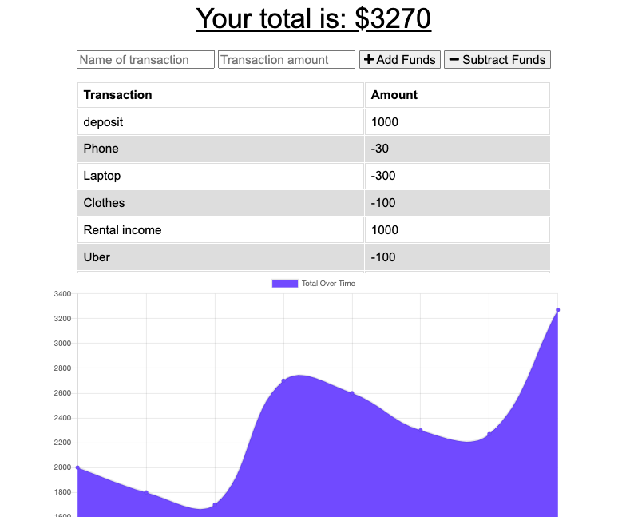

# budget-tracker
This Progressive Web Applications budget tracker application allows for offline access and functionality. Users can add expenses and deposits to their budget with or without a connection. If the user enters transactions offline, the total should be updated when they're brought back online.

## Technologies
* MongoDB
* Mongoose
* IndexDB
* Express
* Service Worker
* Javascript
* Heroku

## Screenshot

 
    </img>

## GitHub Repo
https://github.com/minhhap/budget-tracker

## Deployed Link
https://minhha-budget-tracker.herokuapp.com/